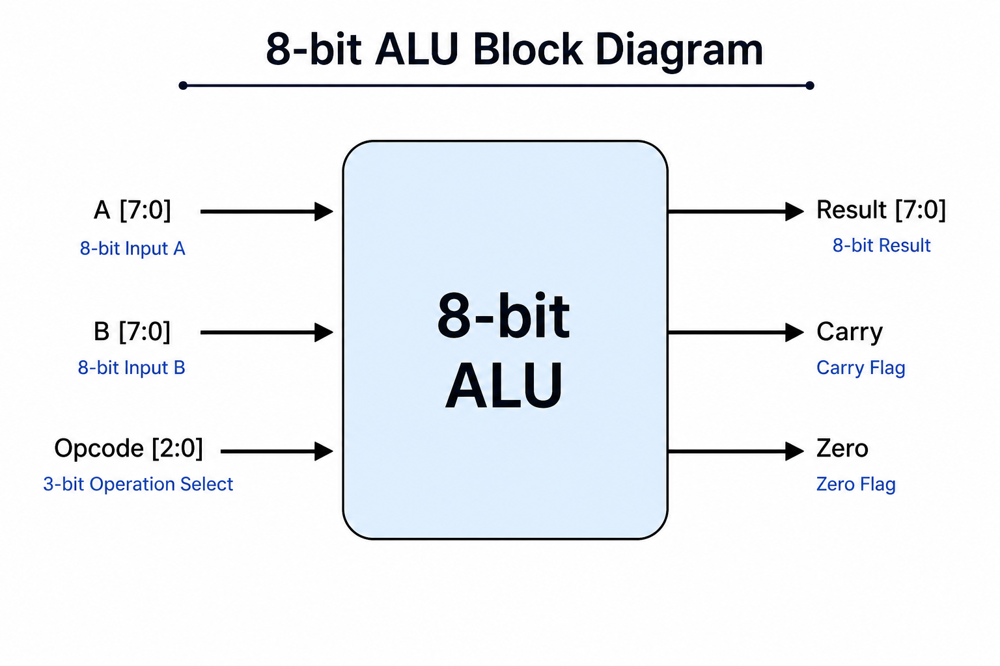

# 8-bit ALU using Verilog HDL

## Overview

This project implements an 8-bit Arithmetic Logic Unit (ALU) using Verilog HDL. The ALU performs arithmetic and logical operations based on a 3-bit opcode.

---

## Features

- 8-bit Arithmetic and Logical Operations
- Functional Verification using Verilog Testbench
- Simulation using Icarus Verilog
- Version Control using Git and GitHub

---

## Supported Operations

| Opcode | Operation |
|---------|-----------|
|000|Addition|
|001|Subtraction|
|010|AND|
|011|OR|
|100|XOR|
|101|NOT|
|110|Left Shift|
|111|Right Shift|

---

## Block Diagram



---

## Simulation Waveform


---

## Project Structure

```
8bit-ALU/
│
├── docs/
├── src/
├── testbench/
├── README.md
└── .gitignore
```

---

## Tools Used

- Verilog HDL
- Icarus Verilog
- VS Code
- Git
- GitHub

---

## How to Compile

```bash
iverilog -o alu_sim src/alu.v testbench/alu_tb.v
```

---

## How to Run

```bash
vvp alu_sim
```

---

## Author

Ishita Chaudhary