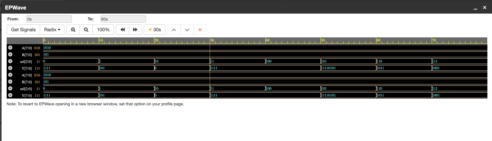

# 8-bit ALU using Verilog HDL

## Overview

This project implements an 8-bit Arithmetic Logic Unit (ALU) using Verilog HDL. The ALU performs arithmetic and logical operations based on a 3-bit opcode.

## Features

- Addition
- Subtraction
- AND
- OR
- XOR
- NOT
- Left Shift
- Right Shift

## Inputs

- A [7:0]
- B [7:0]
- Opcode [2:0]

## Outputs

- Result [7:0]
- Carry Flag
- Zero Flag

## Project Structure

src/
testbench/
simulation/

## Tools Used

- Verilog HDL
- Icarus Verilog
- Git
- GitHub
- VS Code

## How to Run

iverilog -o alu_sim src/alu.v testbench/alu_tb.v

vvp alu_sim

## Simulation Waveform

The following waveform verifies the functionality of the 8-bit ALU.

